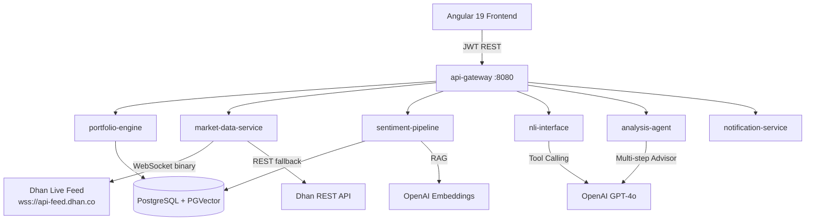

# WealthEngine – Build Walkthrough

## What Was Built

**WealthEngine** is a 3-tier financial analysis platform for Indian retail investors.

---

## Architecture Overview



---

## File Structure

```
PortfolioManager/
├── pom.xml                        ← Root Maven multi-module POM
├── .env.example                   ← Copy → .env and fill secrets
├── docker-compose.yml             ← One-command stack launch
├── scripts/init-pgvector.sql      ← Enables pgvector, hstore, uuid-ossp
│
├── common/                        ← Shared DTOs, enums, exceptions
├── portfolio-engine/              ← TIER 1: XIRR, PortfolioService, Flyway
├── market-data-service/           ← TIER 1: Dhan WebSocket + REST, Caffeine
├── sentiment-pipeline/            ← TIER 2: PGVector RAG + news scraper
├── nli-interface/                 ← TIER 2: Spring AI Tool Calling
├── analysis-agent/                ← TIER 3: Multi-step ChatClient advisor
├── notification-service/          ← Daily 9AM email: Spring Mail + Thymeleaf
├── api-gateway/                   ← Spring Boot app: security, controllers
│   └── src/main/resources/
│       └── application.yml        ← All configuration (DB, AI, Dhan, JWT)
│
└── frontend/                      ← Angular 19
    ├── src/app/
    │   ├── store/portfolio/       ← NgRx: portfolio feature slice
    │   ├── store/agent/           ← NgRx: agent/chat feature slice
    │   ├── core/services/         ← PortfolioService (typed HTTP client)
    │   ├── components/
    │   │   ├── net-worth/         ← D3.js treemap (Stocks > MF > NPS > EPF > PPF > FD)
    │   │   ├── live-console/      ← Analyze mode + NLI chat mode
    │   │   └── daily-recs/        ← AI recommendation cards
    │   └── pages/dashboard/       ← Main dashboard page
    ├── tailwind.config.js
    ├── nginx.conf
    └── Dockerfile
```

---

## Getting Started

### 1. Fill in secrets
```bash
cp .env.example .env
# Edit .env with your: Dhan credentials, OpenAI API key, Gmail app password, JWT secret
```

### 2. Start the database
```bash
docker compose up postgres -d
# Wait for: "wealthengine-postgres is healthy"
```

### 3. Run the backend
```bash
cd /Users/adithya/Projects/PortfolioManager
mvn install -DskipTests
mvn spring-boot:run -pl api-gateway
# Backend: http://localhost:8080
# Swagger UI: http://localhost:8080/swagger-ui.html
```

### 4. Run the frontend
```bash
cd frontend
npm install
npm start
# Frontend: http://localhost:4200
```

### 5. (Optional) Full Docker stack
```bash
docker compose up --build
# Frontend: http://localhost:4200  |  Backend: http://localhost:8080
```

### 6. Default login
- Username: `admin`
- Password: `changeme`

---

## Key Technical Decisions

| Decision | Choice | Rationale |
|---|---|---|
| Market data | Dhan WebSocket + REST fallback | Live ticks via binary WS; REST for snapshots when WS down |
| LLM | OpenAI gpt-4o | Best tool-calling quality; swap to Gemini via 1 config line |
| Embeddings | text-embedding-3-small (1536d) | Good quality, cost-effective for news RAG |
| Cache | Caffeine (500 entries, 5s TTL) | Sub-ms latency for repeated tick lookups |
| Circuit breaker | Resilience4j | Auto-recovers from Dhan API outages |
| Migrations | Flyway | Schema as code, reproducible DB state |

---

## Verification Tests

```bash
# Run XIRR unit tests (9 test cases)
mvn test -pl portfolio-engine -Dtest=XirrCalculatorTest

# Full build (skip tests)
mvn clean install -DskipTests

# Health check
curl http://localhost:8080/actuator/health

# Login and get JWT
curl -X POST http://localhost:8080/api/v1/auth/login \
  -H 'Content-Type: application/json' \
  -d '{"username":"admin","password":"changeme"}'

# Portfolio summary (with token)
curl -H 'Authorization: Bearer <token>' http://localhost:8080/api/v1/portfolio/summary

# Analyze a stock
curl -X POST -H 'Authorization: Bearer <token>' \
  http://localhost:8080/api/v1/analyze/INFY
```

---

## What Requires API Keys Before Working

| Feature | Key Required |
|---|---|
| Live market ticks | `DHAN_ACCESS_TOKEN` + `DHAN_CLIENT_ID` |
| News sentiment (RAG) | `OPENAI_API_KEY` |
| NLI chat queries | `OPENAI_API_KEY` |
| AI stock analysis | `OPENAI_API_KEY` |
| Daily email reports | Gmail SMTP credentials |

> [!TIP]
> Everything except AI features works without any API keys. Add holdings to the DB manually or via Swagger to test the portfolio engine and XIRR calculations immediately.
